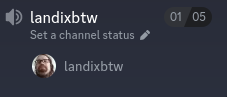
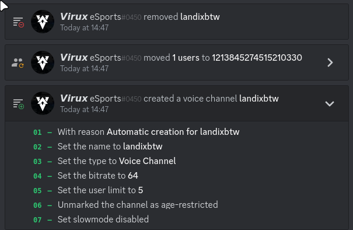
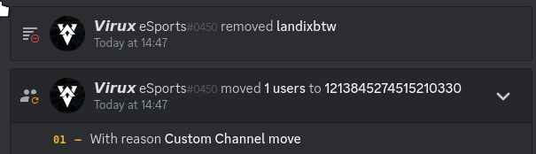
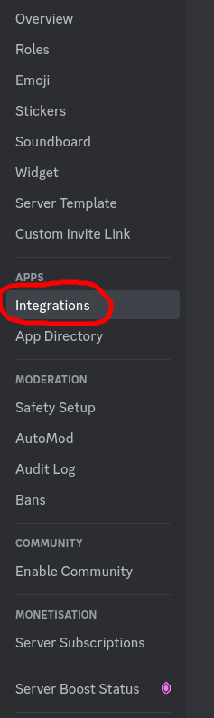
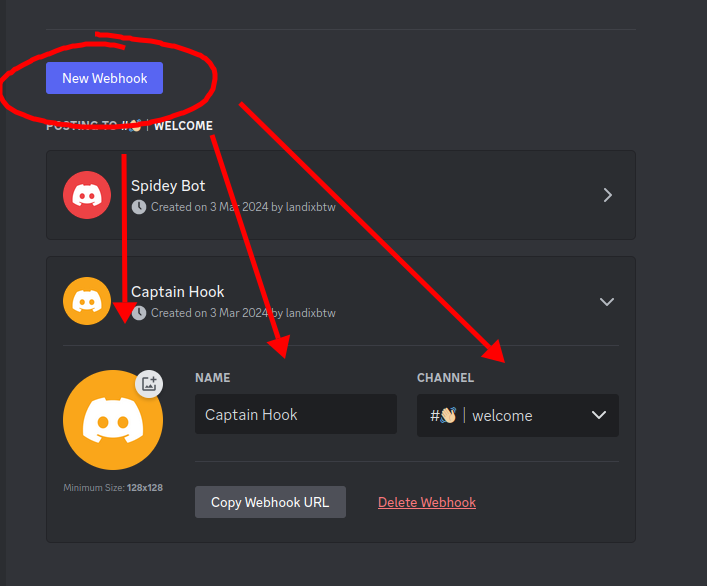
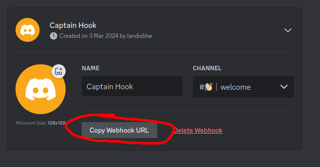
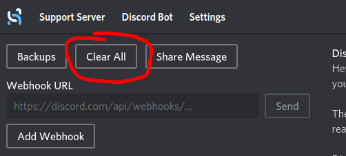
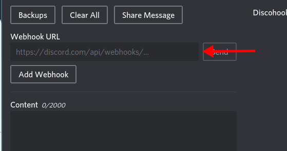
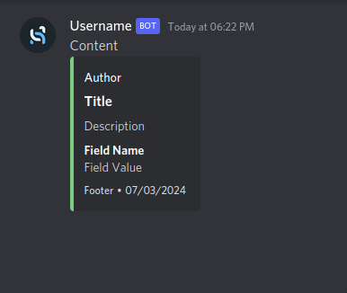

# Virux_eSports

Commissioned bot by Virux_eSports, with following features requested.  

➡️ [x] Willkommensnachricht: Welcome!   Lies dir bitte die #regeln durch, wenn du dich bewerben möchtest, dann öffne gerne unser Bewerbungssystem unter, "#Bewerbung"  
➡️ []Bewerbungssystem:  

- Hey ! Beantworte einfach unsere Fragen, wir melden uns dann so schnell wie möglich zurück.  

  - Für welches Team möchtest du dich bewerben ?  
  - Hast du dir unsere Regeln durchgelesen ? 
  - Wie alt bist du ?
  - Wie bist du auf uns aufmerksam geworden ? 
  - Hast du Ziele ? Wenn ja welche ? 
  - Was erhoffst du dir bei uns ? 
  - Zu guter letzt bitten wir dich uns deinen Epic Namen, alternativ, deinen Fortnite Tracker, Valo Tracker oder CoD Tracker zu senden. 

  Vielen Dank und einen schönen Tag! 

➡️ [x]Join to create voice Channel → Wenn jemand in den join_to_create Voice Channel soll ein eigener Temporärer Voice Channel erstellt werden. 
➡️ []Link von Content Creatorn in den 🔔┃social-media-update posten 

➡️ []Anleitung für Discohook

## Using the Bot

<Join to create voice Channel> Dafür muss ein Voice Channel vorhanden sein der, <code>join_for_voice</code> heißt.  
Sobald jemand in den Voice Channel joint, wird in der Selben Kategorie, ein Channel mit dem Tag der Person erstellt.Z.b.  

 
Sobald der ersteller der Channels diesen verlässt, wird der Channel gelöscht.  
In den Audit-Logs ist das dann so zu sehen.  

## How to use Discohook

Wie man eine Webhook von Discord bekommt. In den Server Einstellungen folgendes wählen.  

Bevor man die die Webhook abschickt oder den Link in Discohook eingibt muss man, den Namen, das Bild und den Channel festlegen.  

Kopiere die Webhook url.  

Um die Webhook zu nutzen muss man als erstes allen clearen.  

Füge die Webhook, hier ein ↓.  

Was hier als Author oder Title geschrieben ist, ist in dem Menü als solches zu finden.

