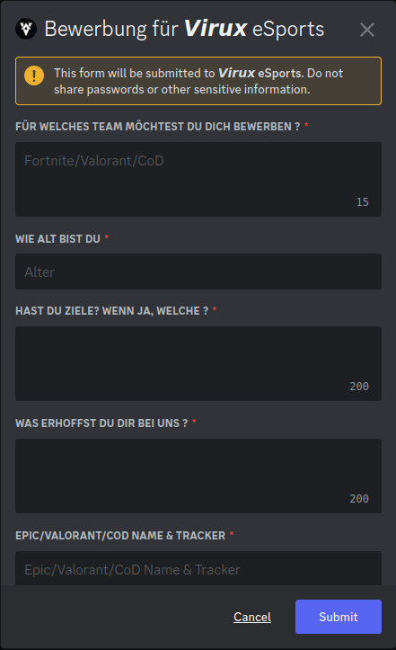

# Virux_eSports

Commissioned bot by Virux_eSports, with following features requested.  

## Using the Bot - Join to create

[Join to create voice Channel]. Dafür muss ein Voice Channel vorhanden sein der, <code>join_for_voice</code> heißt.  
Sobald jemand in den Voice Channel joint, wird in der Selben Kategorie, ein Channel mit dem Tag der Person erstellt.  

 
Sobald der ersteller der Channels diesen verlässt, wird der Channel gelöscht.  
In den Audit-Logs ist das dann so zu sehen.  

## Using the Bot - Apply

[Bewerbungssystem]. Für das Bewerbungssystem muss ein Text Channel <code>bewerbungen</code> vorhanden sein.  
In den <code>bewerbungen</code> schickt der Bot die Bewerbungen rein. Mit <code>!button</code> kann man einen "apply"-button in den Channel schicken lassen in welchem man diesen ausführt.  
Sobal jemand das auf den Button Klick popt dieses Menü auf.  

Nachdem die Bewerbung erfolgreich abgeschickt wurde, bekommt der Bewerber eine Bestätigung und die bewerbung wird in den channel <code>bewerbungen</code>, geschickt.  

Bewerbung für das Team im Bewerbungschannel 

## How to use [Discohook](https://discohook.org)

Wie man eine Webhook von Discord bekommt. In den Server Einstellungen folgendes wählen.  

Bevor man die die Webhook abschickt oder den Link in Discohook eingibt muss man, den Namen, das Bild und den Channel festlegen.  

Kopiere die Webhook url.  

Um die Webhook zu nutzen muss man als erstes allen clearen.  

Füge die Webhook, hier ein ↓.  

Was hier als Author oder Title geschrieben ist, ist in dem Menü als solches zu finden.  

